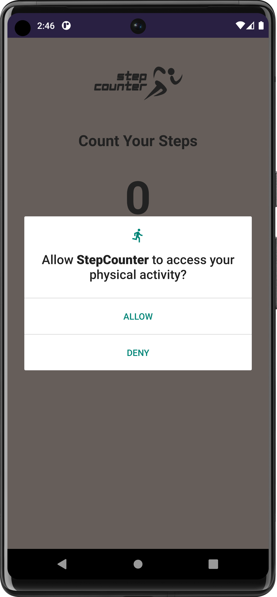
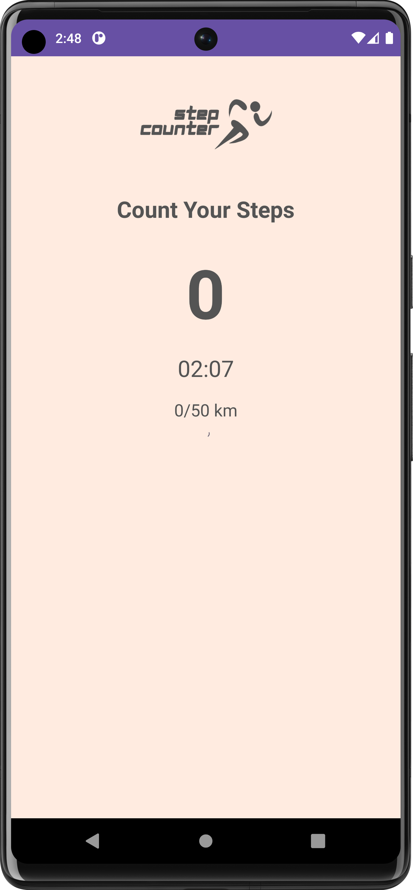

# Step Counter App

![Step Counter App]

This Step Counter app is an Android application that counts the number of steps taken by the user using the step counting sensor on their device. It provides real-time step count updates, elapsed time, and progress towards a predefined goal. The app features a clean user interface with a step count display, a chronometer, a progress bar, and a goal tracker.

## Features

- Real-time step count tracking using the device's step counting sensor
- Display of step count, elapsed time, and progress towards the goal
- Clean and intuitive user interface

## Screenshots

## Getting Started

To use the Step Counter app, follow these steps:

1. Clone the repository.
2. Open the project in Android Studio.
3. Build and run the app on your Android device or emulator.

## Permissions

The Step Counter app requires the following permission:

- `ACTIVITY_RECOGNITION`: To access the step counting sensor on the device.

## Compatibility

- Android 5.0 (API level 21) and above

## License

This project is licensed under the [MIT License](LICENSE).

## Contributions

Contributions are welcome! If you encounter any issues or have suggestions for improvement, feel free to open an issue or submit a pull request.

